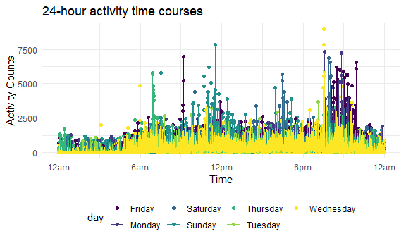

p8105_hw3_hw2861
================
Hongmiao Wang
2022-10-09

``` r
library(tidyverse)
```

    ## ── Attaching packages ─────────────────────────────────────── tidyverse 1.3.2 ──
    ## ✔ ggplot2 3.3.6      ✔ purrr   0.3.4 
    ## ✔ tibble  3.1.8      ✔ dplyr   1.0.10
    ## ✔ tidyr   1.2.0      ✔ stringr 1.4.1 
    ## ✔ readr   2.1.2      ✔ forcats 0.5.2 
    ## ── Conflicts ────────────────────────────────────────── tidyverse_conflicts() ──
    ## ✖ dplyr::filter() masks stats::filter()
    ## ✖ dplyr::lag()    masks stats::lag()

``` r
knitr::opts_chunk$set(
  fig.width = 6,
  fig.asp = .6,
  out.width = "90%"
)

theme_set(theme_minimal() + theme(legend.position = "bottom"))

options(
  ggplot2.continuous.colour = "viridis",
  ggplot2.continuous.fill = "viridis"
)

scale_colour_discrete = scale_colour_viridis_d
scale_fill_discrete = scale_fill_viridis_d
```

## Question 2

First, i will Load and tidy the **Accelerometer** data.

``` r
Accelerometer = read_csv("Dataset/accel_data.csv") %>%
janitor::clean_names() %>% 
mutate(weekday_vs_weekend = recode(day,"Monday" = "Weekday", 
 "Tuesday"= "Weekday", "Wednesday" = "Weekday", "Thursday" = "Weekday",
 "Friday" = "Weekday", "Saturday" = "Weekend", "Sunday" = "Weekend", )) %>%
select(week, day_id, day, weekday_vs_weekend, everything())%>%
pivot_longer(
activity_1:activity_1440,
names_prefix = "activity_",
names_to = "activity_minute",
values_to = "count")
```

    ## Rows: 35 Columns: 1443
    ## ── Column specification ────────────────────────────────────────────────────────
    ## Delimiter: ","
    ## chr    (1): day
    ## dbl (1442): week, day_id, activity.1, activity.2, activity.3, activity.4, ac...
    ## 
    ## ℹ Use `spec()` to retrieve the full column specification for this data.
    ## ℹ Specify the column types or set `show_col_types = FALSE` to quiet this message.

The resulting dataset contains accelerometer data for an 63 year-old
male over a five-week period. In the resulting dataset **Accelerometer**
, there are **50400** observations and **6** variables. These variables
are **week, day_id, day, weekday_vs_weekend, activity_minute, count**.

I aggregate across minutes to create a total activity variable for each
day

``` r
Accel_everyday = Accelerometer %>% 
  group_by(day_id,week,day)%>% 
  summarize(day_activity= sum(count))
```

    ## `summarise()` has grouped output by 'day_id', 'week'. You can override using
    ## the `.groups` argument.

``` r
knitr::kable(Accel_everyday)
```

| day_id | week | day       | day_activity |
|-------:|-----:|:----------|-------------:|
|      1 |    1 | Friday    |    480542.62 |
|      2 |    1 | Monday    |     78828.07 |
|      3 |    1 | Saturday  |    376254.00 |
|      4 |    1 | Sunday    |    631105.00 |
|      5 |    1 | Thursday  |    355923.64 |
|      6 |    1 | Tuesday   |    307094.24 |
|      7 |    1 | Wednesday |    340115.01 |
|      8 |    2 | Friday    |    568839.00 |
|      9 |    2 | Monday    |    295431.00 |
|     10 |    2 | Saturday  |    607175.00 |
|     11 |    2 | Sunday    |    422018.00 |
|     12 |    2 | Thursday  |    474048.00 |
|     13 |    2 | Tuesday   |    423245.00 |
|     14 |    2 | Wednesday |    440962.00 |
|     15 |    3 | Friday    |    467420.00 |
|     16 |    3 | Monday    |    685910.00 |
|     17 |    3 | Saturday  |    382928.00 |
|     18 |    3 | Sunday    |    467052.00 |
|     19 |    3 | Thursday  |    371230.00 |
|     20 |    3 | Tuesday   |    381507.00 |
|     21 |    3 | Wednesday |    468869.00 |
|     22 |    4 | Friday    |    154049.00 |
|     23 |    4 | Monday    |    409450.00 |
|     24 |    4 | Saturday  |      1440.00 |
|     25 |    4 | Sunday    |    260617.00 |
|     26 |    4 | Thursday  |    340291.00 |
|     27 |    4 | Tuesday   |    319568.00 |
|     28 |    4 | Wednesday |    434460.00 |
|     29 |    5 | Friday    |    620860.00 |
|     30 |    5 | Monday    |    389080.00 |
|     31 |    5 | Saturday  |      1440.00 |
|     32 |    5 | Sunday    |    138421.00 |
|     33 |    5 | Thursday  |    549658.00 |
|     34 |    5 | Tuesday   |    367824.00 |
|     35 |    5 | Wednesday |    445366.00 |

Based on the table：

Activity counts at the weekends are generally higher than Activity
counts on the weekdays in the first 2 weeks.But On the last two
Saturdays during week4 and week5 (Day24 and Day31), the patients’
activity counts decreased significantly.

Make a single-panel plot that shows the 24-hour activity time courses
for each day

``` r
Accelerometer %>% 
  group_by(day_id) %>%
  mutate(activity_minute=as.numeric(activity_minute))%>%
  ggplot(aes(x = activity_minute, y = count, color = day)) + 
  geom_point() + geom_line() +
  labs(
    x = "Time",
    y = "Activity Counts",
    title = "24-hour activity time courses") + 
  scale_x_continuous(
    limits = c(0, 1440),
    breaks = c(0, 360, 720, 1080, 1440), 
    labels = c("12am","6am", "12pm", "6pm", "12am")
    )
```



Based on this graph:

Activity counts are generally lower between midnight and 6am. Also, the
activity counts of the patient are lower than 2500 for the majority of
the time. It appears that the highest activity counts are around 9pm to
10pm, especially on Fridays.
