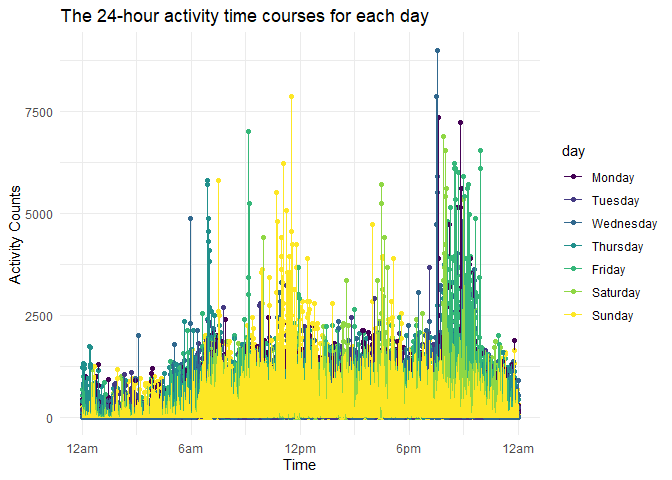

p8105_hw3_hw2861
================
Hongmiao Wang
2022-10-09

``` r
library(tidyverse)
```

    ## ── Attaching packages ─────────────────────────────────────── tidyverse 1.3.2 ──
    ## ✔ ggplot2 3.3.6      ✔ purrr   0.3.4 
    ## ✔ tibble  3.1.8      ✔ dplyr   1.0.10
    ## ✔ tidyr   1.2.0      ✔ stringr 1.4.1 
    ## ✔ readr   2.1.2      ✔ forcats 0.5.2 
    ## ── Conflicts ────────────────────────────────────────── tidyverse_conflicts() ──
    ## ✖ dplyr::filter() masks stats::filter()
    ## ✖ dplyr::lag()    masks stats::lag()

``` r
library(p8105.datasets)

knitr::opts_chunk$set(
  fig.width = 6,
  fig.asp = .6,
  out.width = "90%"
)

theme_set(theme_minimal() + theme(legend.position = "bottom"))

options(
  ggplot2.continuous.colour = "viridis",
  ggplot2.continuous.fill = "viridis"
)

scale_colour_discrete = scale_colour_viridis_d
scale_fill_discrete = scale_fill_viridis_d
```

## Question 2

First, i will Load and tidy the **Accelerometer** data.

``` r
Accelerometer = read_csv("Dataset/accel_data.csv") %>%
janitor::clean_names() %>% 
mutate(weekday_vs_weekend = recode(day,"Monday" = "Weekday", 
 "Tuesday"= "Weekday", "Wednesday" = "Weekday", "Thursday" = "Weekday",
 "Friday" = "Weekday", "Saturday" = "Weekend", "Sunday" = "Weekend", )) %>%
select(week, day_id, day, weekday_vs_weekend, everything())%>%
pivot_longer(
activity_1:activity_1440,
names_prefix = "activity_",
names_to = "activity_minute",
values_to = "count")
```

    ## Rows: 35 Columns: 1443
    ## ── Column specification ────────────────────────────────────────────────────────
    ## Delimiter: ","
    ## chr    (1): day
    ## dbl (1442): week, day_id, activity.1, activity.2, activity.3, activity.4, ac...
    ## 
    ## ℹ Use `spec()` to retrieve the full column specification for this data.
    ## ℹ Specify the column types or set `show_col_types = FALSE` to quiet this message.

The resulting dataset contains accelerometer data for an 63 year-old
male over a five-week period. In the resulting dataset **Accelerometer**
, there are **50400** observations and **6** variables. These variables
are **week, day_id, day, weekday_vs_weekend, activity_minute, count**.

I aggregate across minutes to create a total activity variable for each
day

``` r
Accel_everyday = Accelerometer %>% 
  group_by(day_id,week,day)%>% 
  summarize(day_activity= sum(count))
```

    ## `summarise()` has grouped output by 'day_id', 'week'. You can override using
    ## the `.groups` argument.

``` r
knitr::kable(Accel_everyday)
```

| day_id | week | day       | day_activity |
|-------:|-----:|:----------|-------------:|
|      1 |    1 | Friday    |    480542.62 |
|      2 |    1 | Monday    |     78828.07 |
|      3 |    1 | Saturday  |    376254.00 |
|      4 |    1 | Sunday    |    631105.00 |
|      5 |    1 | Thursday  |    355923.64 |
|      6 |    1 | Tuesday   |    307094.24 |
|      7 |    1 | Wednesday |    340115.01 |
|      8 |    2 | Friday    |    568839.00 |
|      9 |    2 | Monday    |    295431.00 |
|     10 |    2 | Saturday  |    607175.00 |
|     11 |    2 | Sunday    |    422018.00 |
|     12 |    2 | Thursday  |    474048.00 |
|     13 |    2 | Tuesday   |    423245.00 |
|     14 |    2 | Wednesday |    440962.00 |
|     15 |    3 | Friday    |    467420.00 |
|     16 |    3 | Monday    |    685910.00 |
|     17 |    3 | Saturday  |    382928.00 |
|     18 |    3 | Sunday    |    467052.00 |
|     19 |    3 | Thursday  |    371230.00 |
|     20 |    3 | Tuesday   |    381507.00 |
|     21 |    3 | Wednesday |    468869.00 |
|     22 |    4 | Friday    |    154049.00 |
|     23 |    4 | Monday    |    409450.00 |
|     24 |    4 | Saturday  |      1440.00 |
|     25 |    4 | Sunday    |    260617.00 |
|     26 |    4 | Thursday  |    340291.00 |
|     27 |    4 | Tuesday   |    319568.00 |
|     28 |    4 | Wednesday |    434460.00 |
|     29 |    5 | Friday    |    620860.00 |
|     30 |    5 | Monday    |    389080.00 |
|     31 |    5 | Saturday  |      1440.00 |
|     32 |    5 | Sunday    |    138421.00 |
|     33 |    5 | Thursday  |    549658.00 |
|     34 |    5 | Tuesday   |    367824.00 |
|     35 |    5 | Wednesday |    445366.00 |

Based on the table：

Activity counts at the weekends are generally higher than Activity
counts on the weekdays in the first 2 weeks.But On the last two
Saturdays during week4 and week5 (Day24 and Day31), the patients’
activity counts decreased significantly.

Make a single-panel plot that shows the 24-hour activity time courses
for each day

``` r
Accelerometer %>% 
  group_by(day_id) %>%
  mutate(activity_minute=as.numeric(activity_minute))%>%
  ggplot(aes(x = activity_minute, y = count, color = day)) + 
  geom_point() + geom_line() +
  labs(
    x = "Time",
    y = "Activity Counts",
    title = "24-hour activity time courses") + 
  scale_x_continuous(
    limits = c(0, 1440),
    breaks = c(0, 360, 720, 1080, 1440), 
    labels = c("12am","6am", "12pm", "6pm", "12am")
    )
```



Based on this graph:

Activity counts are generally lower between midnight and 6am. Also, the
activity counts of the patient are lower than 2500 for the majority of
the time. It appears that the highest activity counts are around 9pm to
10pm, especially on Fridays.

## Question 3

### Short description of the dataset

Load the **ny_noaa** dataset

``` r
data("ny_noaa")
```

The **ny_noaa** dataset is about the weather data for all New York state
weather stations between **1981-01-01** and **2010-12-31**. The
**ny_noaa** dataset contains **7** columns(variables) and **2595176**
rows(observations).

These variables in this dataset are **id, date, prcp, snow, snwd, tmax,
tmin**. Two of the key variables are the id and date, which tells us
about the id of Weather station and the date of observation. With the
key variables tmax and tmin, we can know the Maximum temperature and
Minimum temperature of the day. The variable like prcp gives us the
information about the Precipitation. The two variables like snow and
snwd give us the information about snowfall and snowdepth in mm.

``` r
colMeans(is.na(ny_noaa))%>%
knitr::kable(col.names = c('Percentage_miss'))
```

|      | Percentage_miss |
|:-----|----------------:|
| id   |       0.0000000 |
| date |       0.0000000 |
| prcp |       0.0561958 |
| snow |       0.1468960 |
| snwd |       0.2280331 |
| tmax |       0.4371025 |
| tmin |       0.4371264 |

For the variables **prcp**, there are **145838** missing values in
total. And the percentage of missing values in variables **prcp** is
**5.62%** . For the variables **snow**, there are **381221** missing
values in total. And the percentage of missing values in variables
**snow** is **14.69%** . For the variables **snwd**, there are
**591786** missing values in total. And the percentage of missing values
in variables **snwd** is **22.80%** . For the variables **tmax**, there
are **1134358** missing values in total. And the percentage of missing
values in variables **tmax** is **43.71%** . For the variables **tmin**,
there are **1134420** missing values in total. And the percentage of
missing values in variables **tmin** is also **43.71%** .

### Part1 in Q3

Do some data cleaning.

``` r
ny_noaa_clean = ny_noaa %>% 
  janitor::clean_names() %>% 
  separate(date, into = c("year", "month", "day"),sep ="-",convert = TRUE)%>% 
    mutate(
    prcp = prcp*0.1,
    tmax = as.numeric(tmax)*0.1,
    tmin = as.numeric(tmin)*0.1)
```

-   After cleaning, I Created separate variables for year, month, and
    day.
-   After cleaning, the unit of precipitation has been change into mm.
    The unit of tmax and tmin has been change into degrees C.

``` r
ny_noaa_clean %>%
  count(snow, name = "n_obs")%>%
  arrange(desc(n_obs))
```

    ## # A tibble: 282 × 2
    ##     snow   n_obs
    ##    <int>   <int>
    ##  1     0 2008508
    ##  2    NA  381221
    ##  3    25   31022
    ##  4    13   23095
    ##  5    51   18274
    ##  6    76   10173
    ##  7     8    9962
    ##  8     5    9748
    ##  9    38    9197
    ## 10     3    8790
    ## # … with 272 more rows

For snowfall, The most commonly observed values is **0**. This commonly
observed value is in line with expectations. As it does not snow on most
days in New York. For the vast majority of days in summer,autumn and
spring, the snowfall should be 0.

### Part2 in Q3

Make a two-panel plot showing the average max temperature in January and
in July in each station across years.

``` r
ny_noaa_clean %>% 
  filter(month == c(1, 7)) %>%
  group_by(id,year,month) %>% 
  summarize(temp_mean_max = mean(tmax),na.rm = TRUE) %>% 
  ggplot(aes(x = year, y = temp_mean_max, color=as.factor(month))) + 
  geom_point() + geom_smooth()+
    labs(
    title = "Average max Temp in Jan and Jul in each station across years",
    x = "Year",
    y = "Average max temperature (°C)") +
 scale_x_continuous(
    limits = c(1980, 2010),
    breaks = c(1980, 1985, 1990, 1995,2000,2005, 2010), 
    labels = c("1980","1985","1990","1995", "2000", "2005","2010")
    ) +
  facet_grid(. ~ month) +
  theme(legend.position = "none") +
  scale_color_manual(values = c("blue", "orange")) 
```

    ## `summarise()` has grouped output by 'id', 'year'. You can override using the
    ## `.groups` argument.
    ## `geom_smooth()` using method = 'gam' and formula 'y ~ s(x, bs = "cs")'

    ## Warning: Removed 6843 rows containing non-finite values (stat_smooth).

    ## Warning: Removed 6843 rows containing missing values (geom_point).


Based on the two-panel plot, We can observe that the average maximum
temperature in January is usually in the range of -10°C to 10°C, with
the mean around 0°C. There were some outliers in January 1982, when they
had an average max temperature around -10°C. Also, outliers were seen in
January 2008, at around -5°C.

We can observe that the average maximum temperature in July is usually
in the range of 20°C to 30°C, with the mean around 27°C. There are more
outliers for average max temperatures in July than in January. The most
obvious one appeared in July 1988, a weather station reported an average
maximum temperature of around 14°C for that month. The other obvious
outlier appeared in July 2010, a weather station reported an average
maximum temperature of around 33°C for that month.

Based on the line generated from geom_smooth, We can tell that the
average maximum temperature across years fluctuates more drastically in
January than in July.
